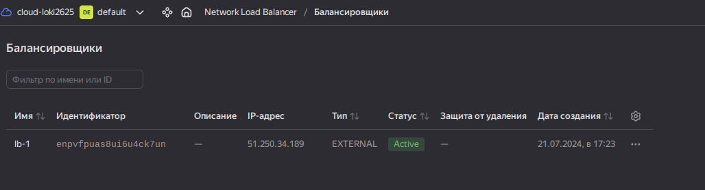
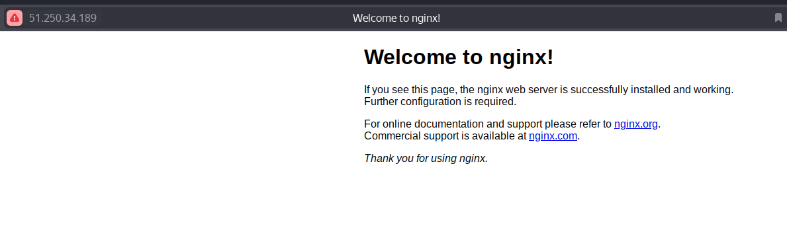

Домашнее задание к занятию 3 «Отказоустойчивость в облаке» - `Воронин Владислав`

### Задание 1

*1. Terraform Playbook:*

```yaml
terraform {
  required_providers {
    yandex = {
      source = "yandex-cloud/yandex"
    }
  }
}

variable "yandex_cloud_token" {
  type        = string
  description = "Данная переменная потребует ввести секретный токен в консоли при запуске terraform plan/apply"
}

provider "yandex" {
  token     = var.yandex_cloud_token #секретные данные должны быть в сохранности!! Никогда не выкладывайте токен в публичный доступ.
  cloud_id  = "b1geeuij36lubph60chm"
  folder_id = "b1g9a0ig1pg9lr4oc5ie"
  zone      = "ru-central1-a"
}

resource "yandex_compute_instance" "vm" {
  count = 2
  name = "vm${count.index}"
  
  resources {
    cores  = 2
    memory = 2
  }  

  boot_disk {
    initialize_params {
      image_id = "fd881ohahi2bf40a3ihh"
    }
  }

  network_interface {
    subnet_id = yandex_vpc_subnet.subnet-1.id
    nat       = true
  }
  
  metadata = { user-data = "${file("./meta.yaml")}" }
  }

resource "yandex_vpc_network" "network-1" {
  name = "network-1"
}

resource "yandex_vpc_subnet" "subnet-1" {
  name           = "subnet-1"
  zone           = "ru-central1-a"
  v4_cidr_blocks = [ "172.24.8.0/24" ]
  network_id     = yandex_vpc_network.network-1.id
}

resource "yandex_lb_target_group" "demo-1" {
  name = "demo-1"
  target {
    subnet_id = yandex_vpc_subnet.subnet-1.id
    address = yandex_compute_instance.vm[0].network_interface.0.ip_address
  }

  target {
    subnet_id = yandex_vpc_subnet.subnet-1.id
    address = yandex_compute_instance.vm[1].network_interface.0.ip_address
  }
}

resource "yandex_lb_network_load_balancer" "lb-1" {
  name = "lb-1"
  deletion_protection = false
  listener {
    name = "my-lb1"
    port = 80
    external_address_spec {
      ip_version = "ipv4"
    }
  }

  attached_target_group {
    target_group_id = yandex_lb_target_group.demo-1.id
    healthcheck {
      name = "http"
      http_options {
        port = 80
        path = "/"
      }
    } 
  }
}

output "lb-ip" {
  value = yandex_lb_network_load_balancer.lb-1.listener
}

output "name" {
  value = tomap({
    for name, vm in yandex_compute_instance.vm : name => vm.network_interface.0.nat_ip_address
  })
}
```

*2. Скриншот статуса балансировщика и целевой группы.*



*3. Скриншот страницы, которая открылась при запросе IP-адреса балансировщика.*


