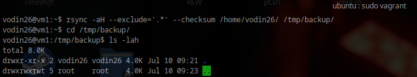
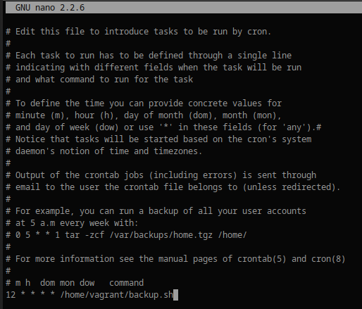
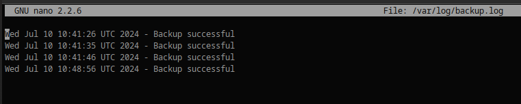
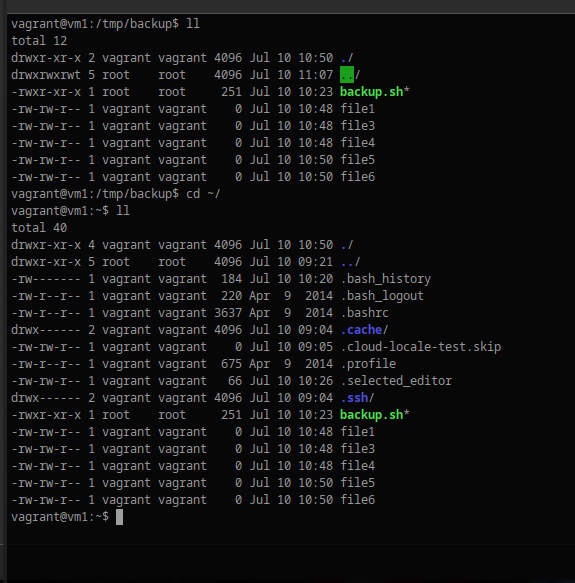

Домашнее задание к занятию 3 «Резервное копирование» - `Воронин Владислав`

### Задание 1

```
rsync -aH --exclude='.*' --checksum /home/vodin26/ /tmp/backup/
```



### Задание 2

Скрипт:

```bash
#!/bin/bash

backup_dir="/tmp/backup"

rsync -aH --exclude='.*' --checksum /home/vagrant/ "$backup_dir"

if [ $? -eq 0 ]; then
  echo "$(date) - Backup successful" >> /var/log/backup.log
else
  echo "$(date) - Backup failed" >> /var/log/backup.log
fi
```

crontab:



Логи:



Бэкап:


